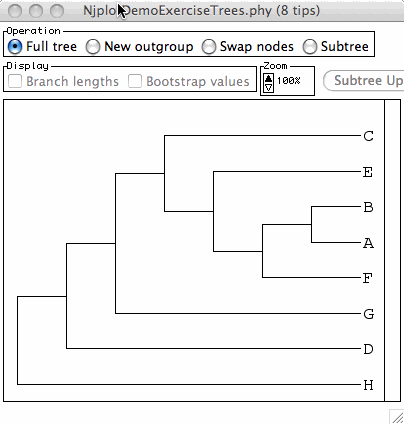
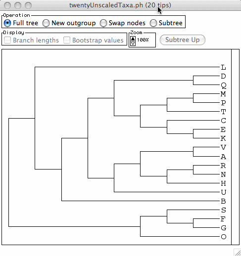
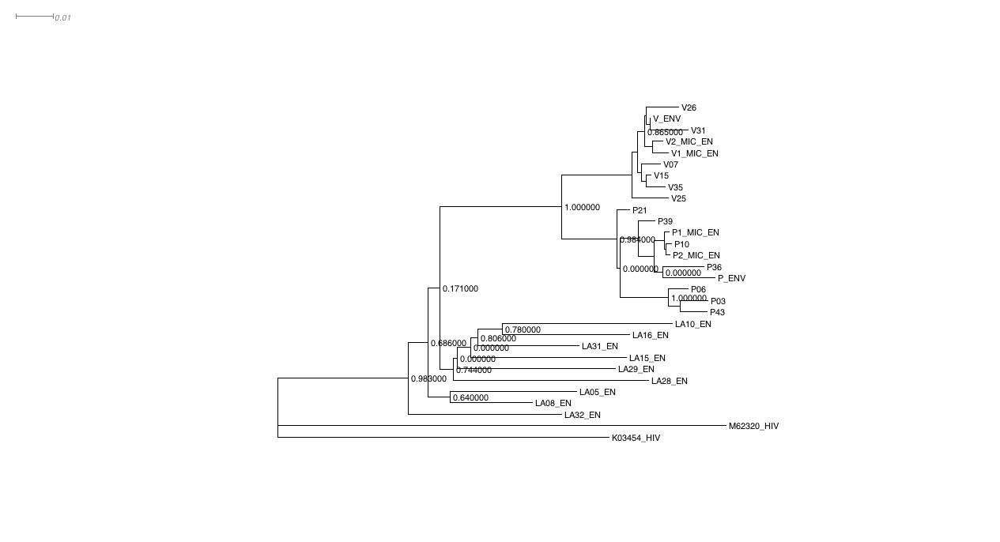
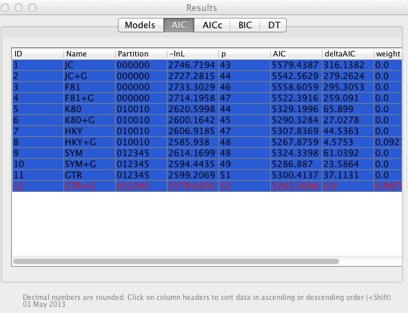
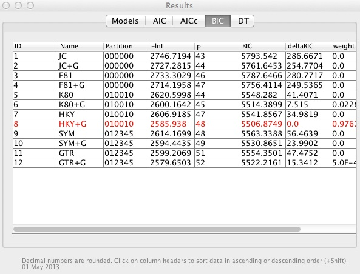
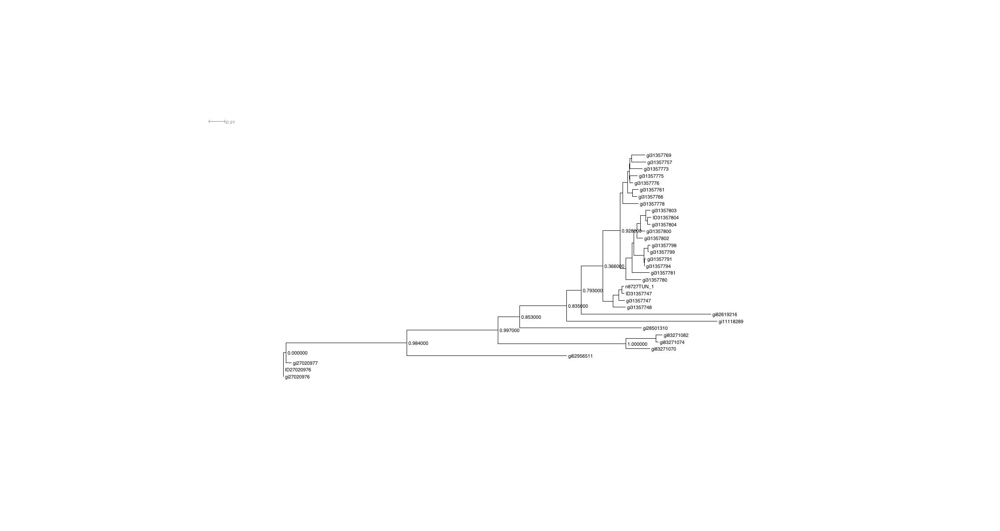
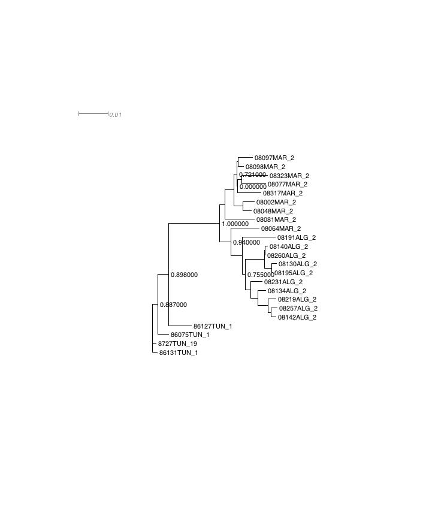

# Interpreting Molecular Phylogenetic Trees

## Table of contents  

- [Phylogeny terminology and concepts "definition" exercise](#definitionExercise)  
- [Visualising trees with NJplot](#NJplotExercise) (we probably won't use this exercise)
- Phylogeny from initial sequences to answering a question
    - ["Conceptual" demonstration with North African dog rabies viruses](#fromPhylogenyQuestionToAnswerConceptDemoDogRabies)
    - ["Conceptual" exercise with Louisiana gastroenterologist example](#fromPhylogenyQuestionToAnswerConceptExerciseLouisianaGastroenterologist)
    - ["Pragmatic" demonstration with North African dog rabies viruses](#fromPhylogenyQuestionToAnswerPragmaticDemoRabies)
    - ["Pragmatic" exercise with North African dog rabies viruses](#fromPhylogenyQuestionToAnswerPragmaticExerciseRabies)
    - [Advanced exercise using Louisiana gastroenterologist data](#fromPhylogenyQuestionToAnswerAdvancedExerciseLouisianaGastroenterologist)
- [Description of Louisiana gastroenterologist dataset](#LouisianaGastroenterologistDatsetDescription)

## Phylogeny Terminology and Concepts

### Notes

This exercise focuses on how we understand vocabulary and concepts associated with phylogenies and molecular evolution. By asking you to write down and discuss you understanding of several fundamental concepts and terms used in the field, the aim is to help highlight:

- the diversity amongst course participants, of our understanding of these different terms and concepts
- assumptions we make concerning these terms and concepts

It has been shown that considering an issue in several different ways e.g. (i) silently on your own (ii) in direct discussion with others or (iii) in a larger group discussion) tends to reinforce our ability to benefit from a given learning experience. Hence the structure of the exercise provided below.

### Exercise

**A. Write down definitions/descriptions of the terms given in the list below (1-3).**

Do this silently, on your own, and please actually write it down (on paper, or in a document on your computer) - formulating your ideas into words like this helps highlight aspects of the topic where your ideas are less clear (i.e. in this case, the parts of the definitions you find hardest to write are those which you feel less confident about)

It might help to begin by looking at the [Wikipedia page for phylogenetic trees](http://en.wikipedia.org/wiki/Phylogenetic_tree). If you do begin by consulting this page, please close the page when you write your own definitions/explanations of these terms, so that you don't find yourself just repeating what's already in the Wikipedia page.

Here are the terms:

1. phylogenetic tree
1. branch (of a phylogenetic tree)
1. root (of a rooted phylogenetic tree)

**B. Once you've finished, compare your definitions with those of your neighbours, and write together consensus definitions of these terms.**

Make notes on how your definitions differ, and write together a definition that agrees with both your ideas of the meaning of these terms.

**C. We'll compare the definitions you have written together with [definitions we prepared before coming to the class](#suggested-definitions) - we'll discuss together any ways in which these pre-prepared definitions differ with the ones you have come up with.**

**D. (If you quickly finish part A. of the exercise) Repeat the above steps, this time selecting two or more terms from the list below.**

1. node (of a phylogenetic tree)
1. polytomy
1. sister group
1. subtree
1. taxonomic unit

If you're interested, you could consult these [definitions/explanations Alexis and I have written for these terms](./documents/phyloTerminologyTakenFromWileyDictionary.pdf).

### Suggested Definitions

**phylogenetic tree**: A description of a path of transmission of genetic information between a set of taxa.
  
**branch** (of a phylogenetic tree): Lineages of taxonomic units that link nodes within a phylogenetic tree.  

**root** (of a rooted phylogenetic tree): In a rooted tree, the node that represents the most recent common ancestor taxon of all other taxa in the tree.  

## Visualising Trees with NJplot

### Learning Objectives

After completing this section, you will hopefully be able to use NJplot to change the way a phylogenetic tree is visualised/drawn by the software by changing the root and rotating subtrees around internal branches to reach a specified/desired representation of a tree.

### Notes

Many applications of phylogenies involve using them to check whether a given set of taxa/organisms/OTUs are related to each other in a particular way i.e. whether the topology of the estimated phylogeny supports a particular set of relationships between OTUs. As a tree with a given topology can be drawn/represented/visualised in many different ways, it can sometimes be tricky to tell whether a given representation of a phylogenetic tree indeed contains the relationship of interest. Thus, working with and changing between different representations of a tree is a useful skill when interpreting the results of phylogenetic analyses.

NJplot does not have many features and options, however it carries out the simple tasks of re-rooting and rotating branches - very useful when attempting to determine whether a given set of relationships exists in a tree, or when comparing to tree topologies - very quickly, which is often all you need when taking a first look at a phylogeny.

This page describes how to carry out these kinds of manipulations using NJplot - we will also demo them for you using the example files on this short ["how to use NJplot" page](./usingNJplot.html).

### Exercise

Load the following NEWICK/PHYLIP format [unscaled phylogenetic file](./trees/eightTaxaUnscaledNjplotExercise.ph) into NJplot and use the software to try and reproduce as closely as possible the following image:

If the previous exercise was easy, try the same thing with the following [tree file](./trees/twentyUnscaledTaxaNjplotExercise.ph) and image:

## Phylogeny from initial sequences to answering a question

### Learning Objectives

After having been shown the demonstrations, and carried out the exercises, listed below, you will hopefully have a better idea about how different tools used in phylogenetic analysis can be linked together to go from having a question of interest, to addressing/informing an answer to that question.

### "Concept" demonstration: from substantive question to an answer using North African dog rabies viruses

Sequences are taken from [this paper](http://www.plospathogens.org/article/info%3Adoi%2F10.1371%2Fjournal.ppat.1001166) published Open Access in [PLoS Pathogens](http://www.plospathogens.org/) (PubMed ID:[21060816](http://www.ncbi.nlm.nih.gov/pubmed/21060816)), which analyses the possible influence of human activity on spread of rabies virus amongst endemic dog populations in North Africa.

#### 1. Pose a substantive question

[**Substantive**](http://www.oxforddictionaries.com/definition/english/substantive) means important, meaningful, considerable (in terms of numbers). Used in our context here, it simply means "a question which there is significant interest or utility in finding an answer to it".

More pragmatically, as scientists who need to publish to be able to continue to work as scientists, a *substantive question* could be considered one whose answer could be published (or would at least increase the publishability/impact of an article).

For pragmatic scientists of this kind, it can be helpful to pose substantive questions where the estimation of a value of a parameter (that is part of a model of your system of interest) can help inform the answer (i.e. change our estimation of the probability that certain answers to the question more or less likely to be true, given the data and the model). This can be helpful, as it suggests an obvious way to begin addressing the substantive (i.e. hopefully publishable) question i.e. by collecting data to obtain an estimate of the parameter(s) of interest.

In the case of this analysis of the epidemiology of rabies virus in North Africa, there are many different substantive questions one could formulate related to this topic e.g.:

1. "Can we identify any public health interventions that could reduce the financial costs of rabies virus infection in North Africa?"
1. "Can we identify environmental or other factors that effect the dynamics of rabies virus infection in North Africa?"
1. "Does human activity influence the dynamics of rabies virus infection in North Africa?"
1. "Are rabies virus samples taken from North Africa more or less likely to be closely-related to each other if sampling locations are separated by a political boundary?"
1. "What is the topology of a phylogenetic tree of North African rabies viruses?"

Clearly the first three questions are substantive; we would of course be very interested, and certainly able to publish, any information that helped inform the answers to these questions. This would have the potential to decrease suffering, and the financial cost, of such infections, so is of interest from medical, welfare, and economic points of view.

The fourth question is less strongly linked to such "interesting" issues; however, it is useful for us, as phylogeneticists, as it is a question that can help address the other, clearly substantive, questions described before it *and* for which it suggests a model (a molecular phylogenetic one), parameter (the topology of a rooted phylogenetic tree), and dataset (a multiple sequence alignment of North African rabies virus samples) for which an estimate of this parameter would make some answers more or less likely.

Understanding and recognising the link between questions of these kinds can help us focus on collecting an appropriate and useful dataset (i.e. one from which a parameter of interest can be estimated); the more specific this question, the easier it is to decide which data to include/collect, and which to leave out (we can very rarely collect all possible data that could be relevant for our analysis, and it can be very useful to have criteria to help us decide what to leave in, what to leave out), and for communicating about their work to others (it's much easier to discuss and help someone with an analysis when you understand what the important questions are that it tries to address).

After all of that discussion... for this demonstration, we're going to assume we have come up with the following substantive question:

*What is the topology of a phylogenetic tree of rabies viruses from North Africa with viruses sampled from several different North African countries?*

#### 2. Build a model involving parameters that, if known, could answer the question

In the context of this course, this will be a *probabilistic model of molecular evolution*, including (for example, as taken from some of Olivier Gascuel's slides):

- a tree topology (to be estimated)
- branch lengths (to be estimated)
- a substitution model (to be [partly] estimated)
- a distribution of site rates (to be estimated)

In the case of the North African rabies virus analysis, the parameter whose value will allow us to address the substantive question is the tree topology.

#### 3. Collect observations informative about the model parameter(s)

In the context of this course, this will almost always be a set of molecular sequences.

In the case of the North African rabies virus analysis, we will use a set of [nucleotide sequences of North African rabies virus phosphoprotein CDSs](./sequences/phosphoproteinCDSsLabelsEd_alphanumericUnderscoreOnly.fasta), whose sequence identifiers have been modified so that its easy to tell which country they were sampled from (if the ID contains ALG it's Algeria, TUN, it's Tunisia, MAR it's Morocco) and to be compatible with the various software used in the analysis (in particular to contain only alphanumeric characters or underscores i.e. '_')

We align the sequences using either [webPRANK webserver](http://www.ebi.ac.uk/goldman-srv/webprank/) or the [MUSCLE webserver](https://www.ebi.ac.uk/Tools/msa/muscle/), both hosted by the EMBL-EBI, giving the following alignments:

- [webPRANK](./sequences/phosphoproteinCDSsLabelsEd_alphanumericUnderscoreOnly.webprank)  
- [MUSCLE](./sequences/phosphoproteinCDSsLabelsEd_alphanumericUnderscoreOnly.muscle)

#### 4. Find best estimate(s) of the parameter(s), conditioned on these observations

The parameter of interest is the topology of the phylogenetic tree of these sequences.

We will only carry out a quick analysis here, using maximum likelihood to estimate topology and branch lengths using PhyML, and jModelTest to estimate an appropriate substitution model to use with PhyML.

##### Estimating best substitution model

Some simple instructions on using jModelTest can be found [here](./usingJModelTest.html).

We will run the analysis using the [webPRANK](./sequences/phosphoproteinCDSsLabelsEd_alphanumericUnderscoreOnly.webprank) alignment of the sequences, calculating likelihood scores using the following parameters:

- Number of substitution schemes->3
- Base frequencies->check
- Rate variation->uncheck both +I and +G
- Base tree for likelihood calculations->Fixed BIONJ-JC

and comparing models using the AIC, to give [this output file](./outputFiles/phosphoproteinCDSsLabelsEd_alphanumericUnderscoreOnly.webprank.jmodeltest.html)

which chooses *GTR* as the best substitution model.

##### Estimating the best phylogeny topology and branch length parameters

We'll use the [PhyML webserver](http://www.atgc-montpellier.fr/phyml/) to get an ML estimate of phylogeny topology and branch lengths.

We use this [PHYLIP interleaved format alignment file](./sequences/phosphoproteinCDSsLabelsEd_alphanumericUnderscoreOnly.webprank.phylip) as input for PhyML. We got this from the previous FASTA format alignment file (that we got by aligning the sequences with webPRANK) using ClustalX.

We'll follow [this very basic description of using PhyML webserver](./usingPhyML.html) to quickly estimate a phylogeny using the substitution model selected by jModelTest.

This gives us the following [phylogenetic tree](./outputFiles/phosphoproteincdsslabelsed_alphanumericunderscoreonly_webprank_phylip_phyml/phosphoproteincdsslabelsed_alphanumericunderscoreonly_webprank_phylip_phyml_tree.txt)

#### 5. Estimate sampling/random error associated with parameter estimate

In this analysis of North African rabies virus samples, to address our substantive question of interest, we are most interested in estimating the topology parameter of the phylogenetic tree for these samples.

Thus, we're in particular interested in estimating the sampling error associated with this parameter estimate.

As it happens, these errors have already been estimated by PhyML (the aLRT SH-like branch support values), and are described in the above tree file.

#### 6. Answer your question using these parameter estimates

Finally we examine the resulting tree file to see which of the possible answers to our substantive question it provides most support for.

We can do that using, for example:  

- [PhyloWidget](http://www.phylowidget.org/), a web browser-based tree visualisation tool, which provides [this set of instructions](http://www.phylowidget.org/vignettes/index.html) to describe how to use it
- [NJplot](http://doua.prabi.fr/software/njplot), which, like the other software described below, is run locally on your machine, and for which we've prepared this [set of basic instructions](./usingNJplot.html)
- [Dendroscope](http://dendroscope.org/), for which we've prepared some [basic instructions](./usingDendroscope.html)
- [FigTree](http://tree.bio.ed.ac.uk/software/figtree/), which I can't find a set of instruction pages for online.

### "Concept"" exercise: from substantive question to an answer using the "Louisiana Gastroenterologist" case as an example

You can read [here](#LouisianaGastroenterologistDatsetDescription) a quick introduction to this dataset.

#### 1. Pose a substantive question

Write a question that relates the issue of the guilt or innocence of the accused in this trial to a phylogenetic analysis of relevant HIV sequences, that clearly highlights the parameters of interest for addressing this question.

A suggested "answer" can be found [here](#A1ConceptGastroenterologistExercise).

#### 2. Build a model involving parameters that, if known, could answer the question

This will be a phylogenetic probabilistic model of the evolution of a set of HIV sequences.

#### 3. Collect observations informative about the model parameter(s)

For very brief instructions on how to build alignments, follow [this link](./buildingMSAs.html)

Align this set of [30 relevant HIV env/gp120 nucleotide sequences](./sequences/thirtySeqsLouisianaGastroUnaligned.fasta). The meaning of the sequence identifiers is described [here in the section on "Sequence/Data"](#LouisianaGastroenterologistDatsetDescription)

Use either a local command-line tool (such as MUSCLE or PRANK) to align the sequences, or a web server such as webPRANK or muscle.

For reference, here are alignments built using the web servers for:

- [webPRANK](./sequences/thirtySeqsLouisianaGastroAligned.webPRANK.fasta)
- [MUSCLE](./sequences/thirtySeqsLouisianaGastroAligned.muscle.fasta).

Clearly, if/when doing an analysis of this kind of your own, collecting an appropriate set of observations is likely to be much more effort that just clicking a link in a webpage and running  automatic alignment software over them

#### 4. Find best estimate(s) of the parameter(s), conditioned on these observations AND 5. Estimate sampling/random error associated with parameter estimate

Use jModelTest to choose a substitution model for your aligned sequences.

Using the [webPRANK alignment in FASTA format](#webPRANKthirtyLouisianGastroAlignment) above, following these [instructions on running jModelTest](./usingJModelTest.html), we got the following [result page](./outputFiles/thirtySeqsLouisianaGastroAligned.webPRANK.fasta.jmodeltest.html), which chooses (using the default options described in the instruction file above) GTR as the best model.

Use PhyML to estimate the topology, branch lengths (i.e. best estimates of relevant parameters), and branch support values (i.e. random error associated with topology parameter estimate), of a phylogenetic tree for these sequences.

Using the [webPRANK alignment in FASTA format](#webPRANKthirtyLouisianGastroAlignment) above, using the GTR model chosen by jModelTest as the best model for this alignment, using [command-line PhyML as described here](./usingPhyML.html), using the [Phylogeny.fr data converter](http://www.phylogeny.fr/version2_cgi/data_converter.cgi) to change the format of the alignment from FASTA to Phylip interleaved ([here is the file converted to Phylip interleaved format](./sequences/thirtySeqsLouisianaGastroAligned.webPRANK.viaPhylogenyFr.phylipInterleaved)), gives the following [tree](./trees/thirtySeqsLouisianaGastroAligned.webPRANK.viaPhylogenyFr.phylipInterleaved_phyml_tree.txt) and the following [general output file](./outputFiles/thirtySeqsLouisianaGastroAligned.webPRANK.viaPhylogenyFr.phylipInterleaved_phyml_stats.txt)

#### 6. Answer your question using these parameter estimates

Visualise the resulting tree using a tree viewer and assess the extent to which the results change your opinion about the guilt or innocence of the accused.

Visualise the tree using one of these tools:

- Dendroscope
- NJplot
- FigTree
- PhyloWidget

A suggested "answer" can be found [here](#A6ConceptGastroenterologistExercise).

#### Answers
#####  1. Pose a substantive question

An obvious question to want to address for this case would be something like *"How likely is it that the defendant committed the crime they are accused of"*.

A more specific question, that links the more general question above to a parameter of a phylogenetic model we could estimate that could inform a question of this kind, could be *"Are the sequences of HIV samples taken from the victim most closely related to (a) those taken from the patient, or (b) to some other sequences sampled from the local Louisiana population?"*.

If the defendant were guilty of the crime, then given certain assumptions, then we would expect to get answer (a).

##### " 6. Answer your question using these parameter estimates

We estimated this tree and visualised it using Dendroscope.

Looking at this tree, assuming it is correctly rooted and that the topology parameter has been correctly estimated, then the victim sequences are most closely related to the patient sequences, which is what we'd expect if the defendant is guilty. Thus, looking at the results of this analysis, I consider it now more probable that the defendant is guilty than before I did the analysis.

### "Pragmatic" Demonstration using North African rabies dataset

Here we will work again with the North African rabies dataset, and will run again through the process of going from a question to an answer. The earlier demonstration of this kind was done to emphasise the conceptual steps we take while doing such an analysis; here, however, we'll focus more on the practicalities of how to carry out the different stages of the analysis.

To remind you, the relevant analysis is described in [this paper](http://www.plospathogens.org/article/info%3Adoi%2F10.1371%2Fjournal.ppat.1001166) published Open Access in [PLoS Pathogens](http://www.plospathogens.org/) (PubMed ID:[21060816](http://www.ncbi.nlm.nih.gov/pubmed/21060816)) which analyses the possible influence of human activity on spread of rabies virus amongst endemic dog populations in North Africa.

#### 1. Choose a question

As discussed above, being aware of (ideally writing down) the specific, substantive questions you want to address with your analysis, is usually helpful for planning and carrying out your analysis. In particular, it can be a big help in guiding decision-making while carrying out the analysis (e.g. deciding which sequences to include, which to exclude, from your analysis.)

In the context of a phylogenetic analysis, it is clearly useful if this question can be informed by estimation of parameter(s) of a phylogenetic model.

In this case, we'll use again:

*"What is the topology of a phylogenetic tree of rabies viruses from North Africa with viruses sampled from several different North African countries?"*

#### 2. Collect sequences

Clearly, the sequences you collect should be relevant to your substantive question i.e. data which should provide information on your parameters of interest.

These could come from:

- public databases that contain sequence data
- samples we send ourselves for sequencing
- non-public sequences collected by others 
  (collaborators/co-workers)

We'll focus our example analysis on phosphoprotein complete CDS nucleic acid sequences

##### Obtaining sequences deposited in a public primary sequence database in association with a particular publication

We'll do this by querying PubMed with the PubMed ID (21060816) to identify the publication record in this database corresponding to the publication of interest, and then linking (within the NCBI's Entrez database system) to nucleotide and/or protein sequences records whose deposition is described in that article, finally exporting these sequences in an appropriate format (e.g. FASTA).

To do this we will:

- Search the Internet for PubMed
- Copy and Paste the PubMed ID into the PubMed search box
- Follow the appropriate link in the "Related Information" 
  section on the right-side menu
- Use the "Advanced" search options and the "Query Builder" 
  to filter out unwanted sequences
   - [YouTube video](http://www.youtube.com/watch?v=dncRQ1cobdc) 
     describing use of these tools
    - A [tutorial](http://www.lib.berkeley.edu/BIOS/pubquick.html)
    on using PubMed searches
- Select appropriate sequence records, and follow the 'Send to' 
  link to download to a file in the appropriate format

##### Using sequence similarity searching to identify similar sequences

Another common way to acquire sequences from public databases for a phylogenetic analysis is to use BLAST to identify sequences similar to a query sequence of interest, and which are likely to be related to this sequence of interest.   

- Take one of the sequences from [this file](./sequences/phosphoproteinCDSsLabelsEd_alphanumericUnderscoreOnly.fasta)
- Use this sequences to query one of the nucleotide sequence databases at the NCBI using [BLAST](http://blast.ncbi.nlm.nih.gov/Blast.cgi), making sure we choose the right program (in this case we want to search a nucleotide database with a nucleotide query sequence); we may want to filter our results if we get too many hits e.g. taking only records matching the string "Africa"

##### Pre-calculated alignments

For rabies phosphoprotein CDSs, there's no resource I can find that provides pre-aligned sets of sequences. Thus, we'll try instead looking for alignments of vertebrate COX2 protein sequences.

We can try this by searching the Internet directly with a generic search engine - trying this in December 2013 I hit these pages:

-   [macromoleculeinsights](http://macromoleculeinsights.com/cox.php)
-   [phosphosite](http://www.phosphosite.org/showMsaAction.do;jsessionid=796A76399AC4C7519AF870A02FACD3AD?protGroup=312573&showAllSites=true)
-   [PFAM](http://pfam.sanger.ac.uk/family/PF00116)

I can try linking out from the [UniProt
record](http://www.uniprot.org/uniprot/P35354) for the protein, in the "phylogenomic databases" and "Family and domain databases" sections.

Or I can go to sites I know have such alignments available such as:

- [HOGENOM](http://pbil.univ-lyon1.fr/databases/hogenom/home.php)
- [TreeFam](http://www.treefam.org/)
- [Ensembl](http://www.ensembl.org/index.html)

Note that there are two, completely different and almost certainly
unrelated proteins called COX2 in humans (PGH2\_HUMAN and COX2\_HUMAN)!

#### 3. Edit sequence identifiers

In almost all analyses, the identifiers associated with the sequences you obtain will need to be changed, for two main reasons:

- so that the identifiers encode *easy-to-read information about the sequences that is relevant for addressing your question of interest*; in this example, addressing the question requires that we know the country from which the viruses (whose sequence we are analysing) were sampled, thus we would want to encode this information in the identifiers for the sequences in the analysis
- so that the various different software tools used to analyse the sequences can read them; in general, this needs us to make sure the identifiers are:
    - unique (i.e. each identifier used in the analysis should be different from each other)
    - do not contain "unusual" characters, ideally restricting the characters used to A-Z, a-z, 0-9 and perhaps also _
    - relatively short (some software requires identifiers that are 10 characters or less long; some other software requires all identifiers be exactly 10 characters long...)

thus I usually choose identifiers that are 10 characters or less long, are unique from each other, and only contain characters A-Z, a-z, 0-9 and _

Here I've selected a set of sequences using the kinds of methods described above, in FASTA format, but [haven't changed the sequence identifiers at all.](./sequences/phosphoproteinCDSsNoLabelEd.txt)

With these identifiers, there is plenty of phylogenetic software that will not accept them as input, even if they accept FASTA format alignment files.

For example, the [RAxML BlackBox web server](http://embnet.vital-it.ch/raxml-bb/index.php) doesn't accept these sequences as input.

However, after I edit the file, [changing it to this](./sequences/phosphoproteinCDSsLabelsEd.txt), so that the first 10 characters are unique (and at the same time making it easy to spot their country of sampling, making the final data visualisation/question answering part of the analysis easier), they are accepted by the RAxML BlackBox web server.

#### 4. Align sequences

Aligned FASTA sequences - google "MUSCLE EBI" or "WEBPRANK" to get links to MUSCLE and PRANK webservers: 

-   [MUSCLE aligned](./sequences/phosphoproteinCDSsLabelsEd.muscle)
-   [PRANK aligned](./sequences/phosphoproteinCDSsLabelsEd.prank)

There are many different tools available, and different tools are better suited for different "kinds" of sequence sets (length, whether DNA, RNA, or protein, number of sequences, how similar the sequences are to each other).

One option (fairly good for fairly divergent protein sequences; which isn't what we're working with here! however, it still gives us an alignment for nucleotide sequences, even if that's not what it's designed for) would be the [MUSCLE webserver](http://www.ebi.ac.uk/Tools/msa/muscle/) at the EMBL-EBI.

For [this alignment](./sequences/relativelyDivergentRabiesCDSsAlignedWithOthersMUSCLEEBI.fasta), we combined the same [set of unaligned sequences given above](./sequences/phosphoproteinCDSsLabelsEd.txt) with several additional [more divergent
sequences](./sequences/relativelyDivergentRabiesCDSs.fasta), and aligned this combined set of sequences together using MUSCLE at the EMBL-EBI.

#### 5. Model Selection

For this we use jModelTest (for nucleotide sequences) or ProtTest (for protein sequences) as appropriate.

Modeltest results from PRANK alignment - use JModelTest on local
machines:

-   [Console PDF](./outputFiles/phosphoproteinCDSsLabelsEd.modeltest.pdf)
-   
-   

Both AIC and BIC choose *GTR+G* as the best model.

#### 6. Phylogeny estimation

Tools typically used to estimate phylogenies for publication are mostly used via a command-line interface.

If you don't want to learn how to use tools in that way, there are however some webservers available that have wrapped some of these programs up in a relatively easy-to-use interface that offer some, but not all, of the functionality of the tools.

-   [Phylemon](http://phylemon.bioinfo.cipf.es/)
-   [Phylogeny.fr](http://www.phylogeny.fr/)

For example, I used Phylogeny.fr with HKY + Gamma, in *a la carte* mode to run analysis, to get the [following tree in NEWICK format](./trees/phosphoproteinCDSsLabelsEd.HKYgamma.phylogeny.fr.ph), which I could then view locally on my machine with Dendroscope, NJPlot, or FigTree, or remotely via [PhyloWidget](http://www.phylowidget.org/).

Below, I've analysed the [initial dataset together with several more divergent sequences, aligned by the EMBL-EBI muscle web server, as given above](./sequences/relativelyDivergentRabiesCDSsAlignedWithOthersMUSCLEEBI.fasta), using PhyML from the command line as [described here](./usingPhyML.html).

Firstly, I changed the format to Phylip (interleaved) using the [Phylogeny.fr Data Converter](http://www.phylogeny.fr/version2_cgi/data_converter.cgi), to give [this alignment](./sequences/relativelyDivergentRabiesCDSsAlignedWithOthersMUSCLEEBI.PhylogenyFrFormatChange.phylipInterleaved)

This used the same options as described above, apart from:

- in the "Substitution Model" menu, using:
    - One category of substitution rate (yes/no)  **no**
    - Number of substitution rate categories  **4**
    - Gamma distributed rates across sites  **yes**
    - Gamma distribution parameter (fixed/estimated) **estimated**
    
These changes were needed to run with the GTR+gamma substitution model, rather than the GTR substitution model.

This gave the following files:

- [Newick format tree file with SH-like branch supports](./trees/relativelyDivergentRabiesCDSsAlignedWithOthersMUSCLEEBI.PhylogenyFrFormatChange.phylipInterleaved_phyml_tree.txt)
- [general output file](./outputFiles/relativelyDivergentRabiesCDSsAlignedWithOthersMUSCLEEBI.PhylogenyFrFormatChange.phylipInterleaved_phyml_stats.txt)

#### 7. Algorithm Diagnosis

Before drawing strong conclusions from the results of the phylogeny estimation, for example before publishing them, we should explore a range of different possible sources of error that could have led to inaccurate parameter estimation.

Here we will just explore one of these i.e. the impact of using different substitution models for the analysis.

Using command line phyml, as above, I re-ran the analysis using the GTR model (i.e. without gamma), and using the JC + gamma model.

Here are the result files:

- GTR (without gamma)
    - [Newick format tree](./trees/relativelyDivergentRabiesCDSsAlignedWithOthersMUSCLEEBI.PhylogenyFrFormatChange.phylipInterleaved_phyml_tree.txt.gtrNoGamma)
    - [general result file](./outputFiles/relativelyDivergentRabiesCDSsAlignedWithOthersMUSCLEEBI.PhylogenyFrFormatChange.phylipInterleaved_phyml_stats.txt.gtrNoGamma)
- JC + gamma
    - [Newick format tree](./trees/relativelyDivergentRabiesCDSsAlignedWithOthersMUSCLEEBI.PhylogenyFrFormatChange.phylipInterleaved_phyml_tree.txt.JCGamma)
    - [general result file](./outputFiles/relativelyDivergentRabiesCDSsAlignedWithOthersMUSCLEEBI.PhylogenyFrFormatChange.phylipInterleaved_phyml_stats.txt.JCGamma)

Other simple things we could have tried would be to change the details of way PhyML does its tree search (in the **Tree Searching** menu), or to check to see which result you get when running an analysis using another maximum likelihood tree estimator such as RAxML.

#### 8. Examine the results of your analyses and address your substantial question of interest

Look at the tree and decide on how it informs the answer to your question of interest.

Here, using the tree estimated by PhyML using theGTR plus gamma model, is the image of the tree shown in Dendroscope.

You'll see that I made the mistake of running through the analysis without changing the sequence identifiers to contain the information about the country from which the samples were obtained! I'll leave the image here as an example of why it's so important to edit the sequence identifiers in a way that makes answering your substantive question easy...

Here is another tree estimated from these sequences where the identifiers have been edited to indicate the country from which the sequences were sampled:

The Tunisian sequence all cluster together on one end of a branch that separates them from all other sequences in the tree (using 'unrooted tree' language, they form a 'clan').

The same is true for the Algerian sequences.

However this is not true for the Moroccan sequences; there is one branch that separates all but one of the Moroccan sequences into a clan, but there is one sequence (08064MAR_2) that is excluded from the is clan.

Thus, in general, sequences tend to cluster according to country, but they don't form three separate clans; the placement of the 08064MAR_2 sequence could be accurate, indicating, that the history of evolution of the sequences is more complex than one in which the virus was never transmitted across national borders. Alternatively, this estimate of the tree topology parameter could  be wrong, due to errors in data collection or analysis.

### "Pragmatic" Exercise using North African rabies viruses

Try a similar analysis as used for the phosphoprotein complete CDS nucleic acid sequences shown above, using the sequences for glycoprotein partial CDS and intergenic spacer given below

- [Sequence labels unedited](./sequences/glycoproteinPartialAndIntergenicSpacerNoLabelEd.txt)
- [Sequence labels edited to easily identify country of origin](./sequences/glycoproteinPartialAndIntergenicSpacerLabelsEd.txt)

1. Choose a quesiton
    Write down one or more substantive questions we want to address with the analysis

2. Collect an appropriate set of sequences

3. Edit sequence identifiers to be unique, compatible with analysis tools, and meaningful (in the context of allowing us to easily answer our question(s) of interest when examining resulting phylogenetic trees and other results)

4. Align sequences

5. Model Selection

6. Phylogeny estimation

7. Algorithm Diagnosis

8. Parameter estimation

### Advanced Exercise (where you decide yourself which tools to run etc.): the case of the "Louisiana gastroenterologist"

[Metzker et al. PNAS 2002](http://www.ncbi.nlm.nih.gov/pubmed/12388776) describe a phylogenetic analysis of HIV env/gp120 sequences that was used as evidence in the trial of a Louisiana gastroenterologist accused of deliberately infecting someone (the "victim") with HIV-infected blood from one of the gastroenterologist's patients.

In this exercise, you are asked to try this analysis (or at least a similar one) to that carried out by Metzker et al., with the aim of deciding how well the data supports the hypothesis that the victim (whose sequence identifiers all begin with a "V") was directly infected by blood taken from the patient (whose sequence identifiers all begin with a "P").
 
Carry out the analysis beginning with [this file of 30 unaligned env/gp120 sequences](./sequences/thirtySeqsLouisianaGastroUnaligned.fasta).

This contains:

1. selected sequences (we removed some of the sequences to reduce the time needed for several of the analysis steps) taken from the [complete set analysed by Metzker et al.](./sequences/pmid_12388776_MetzkerEtAl2002_only_env_gp120s_cloneNamesOnly.fasta)
1. [two additional, more divergent "reference" sequences](./sequences/twoReferenceHivEnvGp120Seqs_.fa)

To place the analysis in context, consider that the aim of the
prosecution questioning of the expert witnesses in this case was to
establish whether the virus samples in the victim and the patient were "closely related". [This article](http://www.cmj.hr/2005/46/4/16100754.htm), from the [Croatian Medical Journal](http://www.cmj.hr/), (Budowle and Harmon, 2005; 46:514-21) gives some background on the legal context of this questioning. The jury was (at least as far as I understand it) charged with addressing the question whether it was beyond reasonable doubt that the victim was infected as a result of the actions of the gastroenterologist; the results of the phylogenetic analysis are only a small part of the evidence they considered when trying to answer this question.

You might also be interested to read the following documents, which are the decisions of the first and second appeals to the guilty verdict; they contain some comments/quotes from some of the expert phylogenetic witnesses:

- [1st appeal](http://www.denverda.org/DNA_Documents/schmidt1997.PDF)
- [2nd appeal](http://www.denverda.org/DNA_Documents/schmidt2000.PDF)

Ideally, just use your previous experience to decide how to do this - however, if you need help/suggestions, you could look at the ["Phylogeny analysis workflow" section of this
presentation](./presentations/phyloIntroBuddCrete2014.pdf)
for ideas, and/or look at [these suggestions on what you could try in this particular
case](#suggestedApproachToAdvancedLouisianGastroenterologistExercise)

While doing the analysis, you may find it useful to consider the
following issues/questions:

- did you remove any sequences and/or columns from the alignment    before running the analysis? How/why did you choose these? What    influence would you expect this choice to have on the result of your analysis?
- are there any unusual characters in the data set? how could/did you deal with these? What effects would you expect these different approaches to addressing this problem have on the result?
- which substitution model(s) do you think are the most appropriate to use when analysing this data set?
- to what extent do different estimates of the phylogeny usin different methods agree with each other i.e. how similar are the trees you get from different analyses?
- what do you feel is the right way of thinking about the relationship between branch support (e.g. posterior probabilities) and whether the data supports particular conclusions "beyond reasonable doubt"? For example, bipartition/clade/internal branch posterior probabilities are estimates of the probability that the branch is correct **given** the data and the model (and there may be issues with both of these things that we're conditioning the analysis on). To think about it differently, what do you feel is the relationship between "reality" (i.e. the true description of the processes of evolution that yielded the sequences we use in the analysis) and "branch support"?

For the sake of completeness, here are files containing

1. [the full set of env/gp120 nucleotide sequences used in the study](./sequences/pmid_12388776_MetzkerEtAl2002_only_env_gp120s_cloneNamesOnly.fasta)
2. [the full set of RT-pol sequences described in the study](./sequences/pmid_12388776_MetzkerEtAl2002_only_RT_pol_cloneNamesOnly.fasta)
3. [the trimmed-down set of these sequences described above](./sequences/pmid_12388776_MetzkerEtAl2002_only_env_gp120s_cloneNamesOnly_trimmedForSize.fa)

Here is a short description of how I might go about doing the analysis described above:

aligning sequences:

- [webPRANK](http://www.ebi.ac.uk/goldman-srv/webprank/)  
- [MUSCLE](http://www.ebi.ac.uk/Tools/msa/muscle/)  
- [MAFFT](http://www.ebi.ac.uk/Tools/msa/mafft/)  

removing sequences/columns from the analysis:

- [JalView](http://www.jalview.org/)  

substitution model testing:  

- [PAML](http://abacus.gene.ucl.ac.uk/software/paml.html) (you could also use jModelTest, however)  

visualising trees:  

- [NJplot](http://pbil.univ-lyon1.fr/software/njplot.html)  
- [Dendroscope](http://ab.inf.uni-tuebingen.de/software/dendroscope/)  
- [FigTree](http://tree.bio.ed.ac.uk/software/figtree/)  
- [PhyloWidget](http://www.phylowidget.org/)  

Bayesian phylogeny estimation:  

- [MrBayes](http://mrbayes.csit.fsu.edu/)  

examining features of MrBayes runs:  

- [Tracer](http://tree.bio.ed.ac.uk/software/tracer/)  

maximum likelihood phylogeny estimation:  

- [RAxML](http://icwww.epfl.ch/%7Estamatak/index-Dateien/Page443.htm) or [PhyML](http://www.atgc-montpellier.fr/phyml/)  

checking for agreement between estimated trees:  

- [CONSENSE](http://evolution.genetics.washington.edu/phylip/doc/consense.html) (part of the PHYLIP package), or [SplitsTrees](http://www.splitstree.org/), or [clann](http://bioinf.may.ie/software/clann/)

One way of linking these together would be to:

1. Align the initial set of **nucleotide** (ignoring the fact that they're coding, or at least contain some coding regions) sequences using [webPRANK](http://www.ebi.ac.uk/goldman-srv/webprank/), asking webPRANK to estimate its own tree  
2. for the sake of keeping data processing/formatting issues at a    minimum I'd for now focus on nucleotide models rather than codon or protein models - the fact that they're not perhaps only coding sequences, and might contain some stop codons make it tricky to quickly go with these alternatives
3. remove some sequences from the analysis using JalView
4. realign the sequences automatically using webPRANK
5. estimate the phylogeny using one of the following software, beginning with a GTR + gamma substitution model (which is usually/often a good choice)
    - RAxML
    - PhyML
    - MrBayes
6. re-align the sequences using webPRANK, providing it with the estimated tree to guide the analysis
7. estimate, from the new alignment (perhaps removing more sequences, removing some columns from the analysis) using several different tools, estimating also "support values" i.e. non-parametric bootstraps, aLRTs, posterior probabilities, running each tool more than once with different runs using different start trees/random seeds - again, tools you could use might be:
    - RAxML
    - PhyML
    - MrBayes
8. using the tree, if the reported tree topologies are very similar (I could use CONSENSE in the PHYLIP package to build consensus trees to check how well they agree), I could use jModeltest or PAML or modeltest to test alternative substitution models (e.g. whether HKY plus gamma is a better choice of model for the analysis than GTR plus gamma). jModeltest is easier to use. PAML gives you more control over which tree is used as the context in which to compare the models, and which order and which models to include in the testing.
9. If I ended up preferring a different model, I'd run the analyses above again i.e. estimate the tree again using different methods, different starting trees, different parameters, checking for "good" MCMC behaviour, etc. I'd also use SOWH to test explicit hypotheses of interest concerning branching patterns/bipartitions associated with the question of interest

## Example Dataset: the case of the "Louisiana Gastroenterologist"

### Introduction to the case

[Metzker et al. PNAS 2002](http://www.ncbi.nlm.nih.gov/pubmed/12388776) describe a phylogenetic analysis of HIV env/gp120 sequences that was used as evidence in the trial of a Louisiana gastroenterologist accused of deliberately infecting someone (the "victim") with HIV-infected blood from one of the gastroenterologist's patients.

To place the analysis in context, consider that the aim of the
prosecution questioning of the expert witnesses in this case was to establish whether the virus samples in the victim and the patient were "closely related". [This article](http://www.cmj.hr/2005/46/4/16100754.htm), from the [Croatian Medical Journal](http://www.cmj.hr/), (Budowle and Harmon, 2005; 46:514-21) gives some background on the legal context of this questioning. The jury was (at least as far as I understand it) charged with addressing the question whether it was beyond reasonable doubt that the victim was infected as a result of the actions of the gastroenterologist; the results of the phylogenetic analysis are only a small part of the evidence they considered when trying to answer this question.

You might also be interested to read the following documents, which are the decisions of the first and second appeals to the guilty verdict; they contain some comments/quotes from some of the expert phylogenetic witnesses:

- [1st appeal](http://www.denverda.org/DNA_Documents/schmidt1997.PDF)
- [2nd appeal](http://www.denverda.org/DNA_Documents/schmidt2000.PDF)

### Sequences/data

In the exercises related to this dataset, I typically ask you to try an analysis (or at least a similar one) to that carried out by Metzker et al., with the aim of deciding how well the data supports the hypothesis that the victim (whose sequence identifiers all begin with a "V") was directly infected by blood taken from the patient (whose sequence identifiers all begin with a "P").

Note that sequence identifiers begin either with:

- "LA" - this indicates that it was isolated from a non-victim non-patient individual who was located in Louisiana
- "P" - this indicates it was isolated from the patient; note that several samples were taken from the patient at several different time points, and that the sequences of these samples are non-identical, hence there being several included in the analysis
- "V" - this indicates it was isolated from the victim; note that several samples were taken from the victim at several different time points, and that the sequences of these samples are non-identical, hence there being several included in the analysis
- some other letter/number - these are the reference sequences sampled from outside Louisiana

The following files may be useful starting points for your analysis:   

- [30 unaligned env/gp120 nucleotide sequences](./sequences/thirtySeqsLouisianaGastroUnaligned.fasta)
- the 30 nucleotide sequences in the file above were selected from [the complete set of 132 env/gp120 sequences analysed by Metzker et al.](./sequences/pmid_12388776_MetzkerEtAl2002_only_env_gp120s_cloneNamesOnly.fasta). A reduced set of sequences is provided to reduce the time needed for several of the analysis steps)
- the 30 sequences above also includes [two additional, more divergent "reference" sequences](./sequences/twoReferenceHivEnvGp120Seqs_.fa) to serve as a comparison to the sequences described in Metzker et al.'s analysis

### Why use this dataset as an example? 

It has been shown that we learn more effectively when working with problems that we find interesting or relevant; for example, a course that made use of the same dataset you were doing your own research on would be great, as obviously you'd be interested in the data and the results, and what you would be learning would clearly be relevant to you.

However, in a class where everyone works on different data, and different kinds of research questions (which is usually the case), there will not be a dataset that is directly relevant to the work of all trainees. Thus, the challenge is to find a dataset which all/most/many trainees will find interesting, important, or relevant in a way that's not directly related to their specific work.

The "Lousisiana Gastroenterologist" datasets described here have been chosen as an example of a phylogenetic analysis where everyone can understand the importance of obtaining an as-accurate as-precise as possible estimation of parameters of the phylogenetic model; the data was presented as evidence in a murder trial, and thus had the opportunity to have a huge impact on the life of an individual; if presented in a case where capital punishment were a possible sentence, it would even be in a position to directly influence the life or death of the accused.

On top of that, there seems to be something ghastly fascinating in stories of betrayal, sex, and violence of this kind, and this seems to provide a good hook to keep our attention and interest when working with the data.

