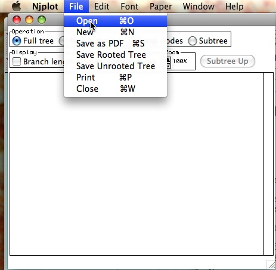
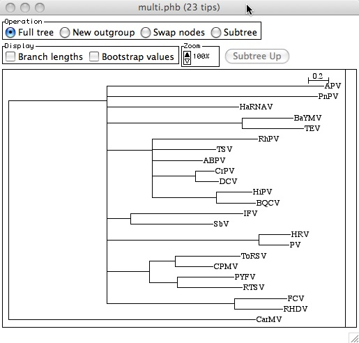
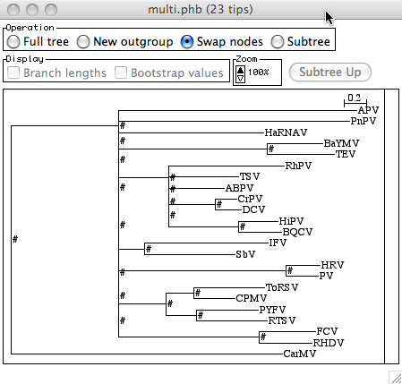
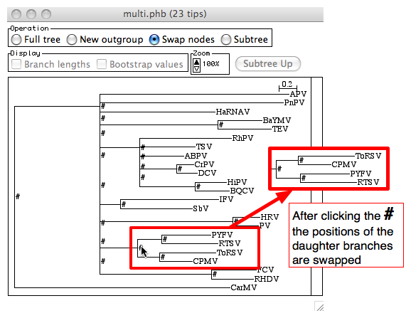
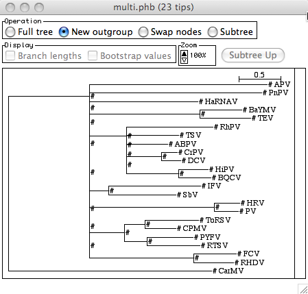
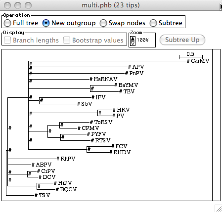
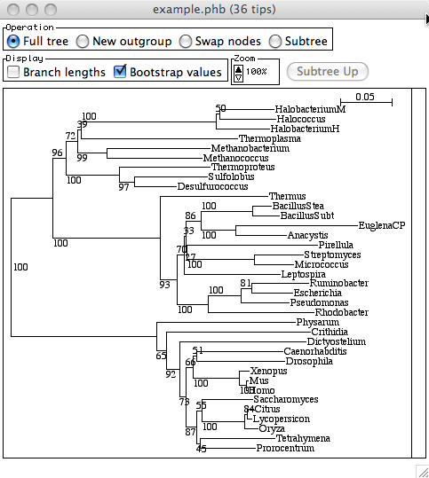

# Using NJplot

## Introduction
NJplot was written to view and investigate rooted phylogenetic trees estimated using the neighbor-joining (NJ) algorithm, described in [this article](http://www.ncbi.nlm.nih.gov/pubmed/8905155) and distributed by the University of Lyon 1 under [this link](http://doua.prabi.fr/software/njplot)

NJplot is ideal for examining the initial results of a phylogenetic analysis, as long as the method used to estimate the phylogeny yields a bifurcating tree (as old versions of NJplot can not represent non-bifurcating trees - although newer versions e.g. 2.3 are able to display such trees). NJplot is ideal for this as it makes it both quick and easy to rotate subtrees around internal branches, basic but key features needed when exploring and comparing a tree with expectations/other trees.

There are many software packages available for viewing trees, many of which offer more features and options than NJplot (for example [Dendroscope](http://ab.inf.uni-tuebingen.de/software/dendroscope/welcome.html) or [FigTree](http://tree.bio.ed.ac.uk/software/figtree/)). These additional features can make these tools much more appropriate than NJplot as a starting place for preparing figures that include phylogenetic trees - however, the basic tasks of subtree rotation and rerooting are typically considerably quicker and easier to carry out in NJplot than more complex packages.

Additionally, NJplot is fairly forgiving in the variety of input formats it accepts - allowing us to examine trees from most sources without manually editing the input files.

## Example files

The following are the two example tree files provided with version 2.3 of NJplot

- [Bifurcating tree](./trees/bifurcatingNjplotExample.phb)
- [Multifurcating tree](./trees/multiNjplotExample.phb)

We can use these to see how to do the following in NJplot

- load trees
- rotate subtree around internal branches
- re-root the tree
- display internal branch labels

## Opening a file with NJplot

File->Open from the menu bar to select a file containing a NEWICK format phylogenetic tree

After opening the tree, your window should look something like this

## Rotate subtree around internal branch
Firstly, you need to change the "Operation" from "Full Tree" (the default when opening the tree file, as shown in the above image) to "Swap nodes". After changing the operation like this, the midpoint of each node is labeled with a "#" sign - nodes are represented by vertical lines in the rectangular representation of trees used by NJplot (see the image below).

Secondly, click on one of the # signs to swap the order of the two daughter branches associated with that node - see below for an example.

To remove the # signs from the tree, choose the "Full tree" operation again.

## Rerooting the tree
Firstly, change the operation to "New outgroup" as shown below.

As for the "Swap nodes" operation, this causes the tree to become decorated with # signs - however, there is no longer a # associated with the root node of the tree, and there are now # signs associated with all OTUs/taxa labels.

To reroot the tree, simply click on the appropriate # symbol - for example, clicking on the # at the end of the "TSV"-labeled terminal branch yields the tree shown below.

## Saving a rooted tree

NJplot accepts as input both rooted and unrooted trees.

If you have input a rooted tree to NJplot, and have then rearranged and rerooted it into a convenient representation you would like to use in other software, you can save the tree in NEWICK format to represent the tree in a way that reflects how you have displayed and rooted it.

While the tree output in this way should unambiguously specify the position of the root of the tree as shown in your representation, there is no guarantee that the rotated order of the branches will be the same if it is loaded into another tree viewer.

To save the tree in this way do:
File->Save Rooted Tree

## Displaying internal branch labels/bootstrap support values

NJplot can label internal branches of the tree using values/strings written after the parentheses describing an internal tree branch. For example, this excerpt from the multifurcating tree example file given at the top of this page will label the internal branch that defines the clan TEV and BaYMV with the label "55"

(TEV:0.60499,BaYMV:0.49954)55:1.32670

Labels provided in this way often describe the number of trees that contain the split specified by the branch in a set of trees estimated from non-parametric bootstrapped datasets - for example, bootstrapped trees estimated by CLUSTALX are labeled in this way.

To show these labels, switch on the "Bootstrap values" display, as shown below.

Author: Aidan Budd